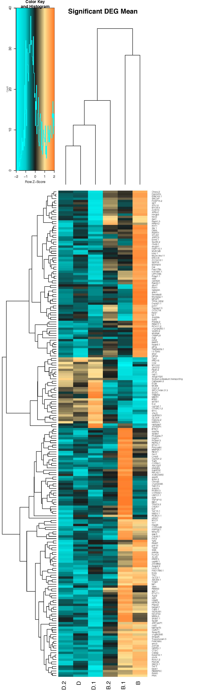

- Set your working directory; if your files are in folders, you have to specify the command to enter the folder with a slash
- Load the proper packages

```{r results="hide", message=FALSE, warning=FALSE}
setwd("/Users/mariaingersoll/Desktop/BU Research/Davies-Gilmore")
library("DESeq2")
library("ggplot2")
```
- Read in counts using read.table, of pre-filtered count data. The function read.table reads a file in table format and creates a data frame from it (cases corresponding to lines and variables to fields in the file)
```{r}
countData <- read.table("fav_uptake_cleaned_BM3.txt")
head(countData)
```
- All data were previously filtered for a base mean of 3
- Now determine the length of the data file 
```{r}
length(countData[,1])
```
- Get and plot total counts data for each reinfection experiment
```{r}
totalCounts=colSums(countData)
totalCounts
barplot(totalCounts, col=c("green",  "green", "green", "blue" , "blue" , "blue"), ylab="raw counts")
min(totalCounts)
max(totalCounts)
```
- What we see from the above barplot is that some of our samples have high count numbers (BR.C, DR.A, and DR.C) but others have very low count data (BR.A, BR.B, annd DR.B). Keep this count data in mind as it will be very important when analying the differential expression of genes between coral hosting B and coral hosting D

- Now create the vector "treat" of each strain
- Then turn the vector "treat" into a dataframe called "g"
- Rename the dataframe "colData"
```{r}
treat=c( "B", "B", "B", "D", "D", "D")
g=data.frame(treat)
g
colData<- g
colData
```

- run DESeqDataSetFromMatrix and name it dds with countData for matrix input, colData for columns, and "treat" to dictate how the counts for each gene depend on the variables in colData
- then run DESeq on dds
```{r results="hide", message=FALSE}
dds<-DESeqDataSetFromMatrix(countData=countData, colData=colData, design=~treat)
dds<-DESeq(dds)
```
```{r}
head(dds)
res<- results(dds)
```
- The above code gives the log2 fold change (MLE): treat D vs B
- this means that pos log2FC values indicate D is upregulated compared to B
- The name provided in the second element (B) is the baseline

-Next look at the dispersions plot, which basically just tells you the spread of your data
```{r}
plotDispEsts(dds, main="Dispersion plot Uptake")
```

- Now we are going to retrieve the rlog data, which will give us better transformation when size factors vary across samples
- regularized log transformation, transforms count data to log2 scale to minimize differences between samples for rows with small counts

```{r}
rld <- rlogTransformation(dds, blind=TRUE)
head(assay(rld))
hist(assay(rld))
```

- The assay function allows you to access the matrix-like data, so that you can view it bc head(rld) gives you just a summary
- The histogram above displays the frequency of each binned rld count value

- Load the library RColorBrewer
```{r}
library(RColorBrewer)
```
- Making a sample distance heatmap
- as.matrix attempts to turn its argument into a matrix
- dist computes and returns the distance matrix computed using the specified distance measure to compute distances between the rows of a data matrix (assay(rld))
- Create a sample heatmap of the relatedness based on the count distance/difference between samples
```{r results="hide", message=FALSE}
sampleDists <- as.matrix(dist(t(assay(rld))))
library(gplots)
```

```{r}
heatmap.2(as.matrix(sampleDists), key=F, trace="none",
          col=colorpanel(100, "black", "white"),
          margin=c(10, 10))
```

- Now look at results of dds comparing (average) B and D
- The second term is the "control" we will use B as control in this case

```{r}
resBD <- results(dds, contrast=c("treat","D","B"))
```
- How many gene counts have FDR < 10%
- Analyze the count differences between B and D
- This is all quality control
```{r}
table(resBD$padj<0.1)
summary(resBD)
plotMA(resBD, main="B vs D")
```

- Now make a table of the differential expression values (log2fc) between B and D
```{r}
write.table(resBD, file="BD_DE.txt", quote=F, sep="\t")
head(read.delim("BD_DE.txt"))
```
- "BD_DE.txt" contains the log2FC, the pvalue, and the padj, as well as some other data that we don't really need

- Load tidyverse
```{r results="hide", message=FALSE}
library(tidyverse)
```
- Get the p-values from your data file
- Create valBD that is a table from resBD of just the pvalues and adjusted p-values (p-adj)
- Then give the columns approprite names
```{r}
valBD=cbind(resBD$pvalue, resBD$padj)
head(valBD)
colnames(valBD)=c("pval.BD", "padj.BD")
length(valBD[,1])
```
- Return a logical vector in which both cases (pval and padj) are complete (no missing values)
```{r}
table(complete.cases(valBD))
```
- Make a table (that you can visualize via assay) of the rlogdata and pvals
- Then make the column names for rld the same ones that were in colData$treat
```{r}
rlog=rlogTransformation(dds, blind=TRUE) 
rld=assay(rlog)
head(rld)
colnames(rld)=paste(colData$treat)
head(rld)
length(rld[,1])
```
- Combine rld with your table of pval and padj values (valBD)
```{r}
rldpvals=cbind(rld,valBD)
head(rldpvals)
dim(rldpvals)
table(complete.cases(rldpvals))
```
- Create a new csv file from rldpvals
```{r}
write.csv(rldpvals, "timmy_uptake_RLDandPVALS.csv", quote=F)
```
- Now we will create a heatmap of sample distances based on pvalues
- Make a new variable for your csv file
```{r}
rldpvals <- read.csv(file="timmy_uptake_RLDandPVALS.csv", row.names=1)
head(rldpvals)
```
- Make rld that a variable that just returns the first six columns with values (rownames then columns 1-6)
```{r}
rld=rldpvals[,1:6]
head(rld)
```
- dist computes and returns the distance matrix computed using the specified distance measure to compute distances between the rows of a data matrix (rld); determine the overall differences in expression between each sample
- Turn the distances into a matrix
```{r}
sampleDists <- dist(t(rld))
sampleDistMatrix <- as.matrix(sampleDists)
```
- Create a vector of treatment titles for the matrix and apply them to the rows and columns
```{r}
treat=c("B", "B", "B", "D", "D", "D")
colnames(sampleDistMatrix)=paste(treat)
rownames(sampleDistMatrix)=paste(treat)
```
- Install some packages to make heatmaps
```{r results="hide"}
install.packages("pheatmap", repos='http://cran.us.r-project.org')
library("pheatmap")
heat.colors = colorRampPalette(rev(c("blue","yellow")),bias=0.3)(100)
quartz()
```
- Apply your matrix of overall expression distance to a heatmap
```{r}
pheatmap(sampleDistMatrix,color = heat.colors,cex=0.9,border_color=NA,cluster_rows=T,cluster_cols=T)
```

- Load some more packages for the next steps (PCA)
```{r results="hide", message=FALSE}
library(vegan)
library(ggplot2)
library(ggrepel)
library(tidyverse)
```
- Now going to perform PCA on the data to visualize overall effect of experimental covariates and batch effects
- t hides all the columns somehow and just shows the gene identifiers?? I'm not really sure tho, maybe just shows me the rownames
```{r}
rld_t=t(rld)
head(rld)
```
```{r results="hide"}
head(rld_t)
```
- prcomp performs a pca on given data matrix and returns results as an object of class prcomp
```{r results="hide", warning=FALSE}
pca <- prcomp(rld_t,center = TRUE, scale. = TRUE, na.action=na.omit)
head(pca)
```

- sdev is the standard deviations of the principal components
- Using the sdev, calculate the proportion that each PC corresponds to the variance
- Then round PC1 and PC2 (times 100, to 1 sigfig)
```{r}
li <- pca$sdev^2 / sum(pca$sdev^2)
pc1v <- round(li[1] * 100, 1)
pc2v <- round(li[2] * 100, 1)
```
- x from prcomp seems like it's the coordinates of each treatment in the PCA
- turn pca$x into a dataframe
```{r}
pca_s <- as.data.frame(pca$x)
head(pca_s)
```
- Just take PC1 and PC2 and add your sample and treatment names
```{r}
pca_s <- pca_s[,c(1,2)]
head(pca_s)
pca_s$Samples = row.names(pca_s)
head(pca_s)
pca_s$treat=colData$treat
head(pca_s)
```
- Creating your PCA plot
- aes is aesthetic mappings, how variables are mapped to visual properties
```{r}
cbPalette <- c("darkorchid4","firebrick4")
ggplot(pca_s, aes(PC1, PC2, color = treat, pch = treat)) +
  geom_point(size=3) +
  #  geom_text_repel(aes(label=Samples)) +
  scale_colour_manual(values=cbPalette)+
  theme_bw() +
  # geom_density2d(alpha=.5)+
  geom_polygon(alpha=.2)+
  xlab(paste0("PC1: ",pc1v,"% variance")) +
  ylab(paste0("PC2: ",pc2v,"% variance")) 
```

- You can see from this plot that the B samples have very high variance and that there's some overlap between the samples

- I'm skipping the adonis part because it gave me an error and doesn't seem that important


ACTUAL DIFFERENTIAL GENE EXPRESSION ANALYSIS STARTS HERE
- This is just the preliminary GO enrichment analysis of all the genes. The way gomwu works is that it performs rankings and gives you enrichment of GO terms in the ranked list. So GO terms that show up may not actually contain only genes that are significantly differentially expressed, that gene set is just enriched

- Plotting genes within each GO category between B and D
- MF: Molecular function
- BP: Biological process
- CC: Cellular component

- Manipulated BD_DE.txt in excel following Sarah's verbal instructions and loaded it here
- BD_DE_GO has the -log(p-values)
- From the timmy_uptake file, we got log2 fold change (MLE): treat D vs B
- Reminder: this means that pos log2FC values indicate D is upregulated compared to B; The name provided in the second element (B) is the baseline
```{r}
BD_DE_GO = read.csv("BD_DE_GO.csv")
```
- Creating dendrograms (more info can be found in the r file GO_MWU.R)
- First, run MF; edit the input stuff to match what you're running
- BD_DE_GO.csv has two columns of comma-separated values: gene id, continuous measure of significance. To perform standard GO enrichment analysis based on Fisher's exact test, use binary measure (0 or 1, i.e., either significant or not).
- orb_fav_iso2go.txt is two-column, tab-delimited, one line per gene, multiple GO terms separated by semicolon. If you have multiple lines per gene, use nrify_GOtable.pl prior to running this script.
- go.obo is downloaded from http://www.geneontology.org/GO.downloads.ontology.shtml
- goDivision is either MF, BP, or CC
```{r}
head(read.csv("BD_DE_GO.csv"))
input="BD_DE_GO.csv"
goAnnotations="orb_fav_iso2go.txt"
goDatabase="go.obo"
goDivision="MF"
source("gomwu.functions.R")
```
- Calculating stats. It might take ~3 min for MF and BP. Do not rerun it if you just want to replot the data with different cutoffs, go straight to gomwuPlot. If you change any of the numeric values below, delete the files that were generated in previous runs first.
- perlPath: replace with full path to perl executable if it is not in your system's PATH already
- largest: a GO category will not be considered if it contains more than this fraction of the total number of genes
- smallest: a GO category should contain at least this many genes to be considered
- clusterCutHeight: threshold for merginng similar (gene-sharing) terms. See gomwu README for details
```{r}
gomwuStats(input, goDatabase, goAnnotations, goDivision,
           perlPath="perl",
           largest=0.1,
           smallest=5,
           clusterCutHeight=0.25)
```
- Returned 9 GO terms at 10% FDR
- Plot results in a dendrogram
- absValue=-log(0.05,10); genes with the measure value exceeding this will be counted as "good genes". Specify absValue=0.001 if you are doing Fisher's exact test for standard GO enrichment or analyzing a WGCNA module (all non-zero genes = "good genes").
- level1=0.1: FDR threshold for plotting. Specify level1=1 to plot all GO categories containing genes exceeding the absValue.
- level2=0.05: FDR cutoff to print in regular (not italic) font.
- level3=0.01: FDR cutoff to print in large bold font.
- txtsize=1.5: decrease to fit more on one page, or increase (after rescaling the plot so the tree fits the text) for better "word cloud" effect
- treeHeight=0.5: height of the hierarchical clustering tree
- colors=c("dodgerblue2","firebrick1","skyblue","lightcoral") # these are default colors, un-remark and change if needed
- Typing resultsMF gives you the data in a written format
```{r warning=FALSE}
quartz()
resultsMF=gomwuPlot(input,goAnnotations,goDivision,
                  absValue=1,
                  level1=0.1,
                  level2=0.05,
                  level3=0.01,
                  txtsize=1.5,
                  treeHeight=0.5,
)
resultsMF
```

- Doesn't look that pretty, but if you really want it to look nice, run the above code in base R and then you can manipulate the size of the image to your liking, or export it as a pdf and fiddle around with the size
- Red is upregulated in D and blue is downregulated in D (upregulated in B)
- The GO term we are most interested in here is Oxidoreductase, remember this for later

- Now let's run the above protocol for BP
```{r}
head(read.csv("BD_DE_GO.csv"))
input="BD_DE_GO.csv"
goAnnotations="orb_fav_iso2go.txt"
goDatabase="go.obo"
goDivision="BP"
source("gomwu.functions.R")

gomwuStats(input, goDatabase, goAnnotations, goDivision,
           perlPath="perl",
           largest=0.1,
           smallest=5,
           clusterCutHeight=0.25)
```


```{r warning=FALSE}
quartz()
resultsBP=gomwuPlot(input,goAnnotations,goDivision,
                  absValue=1,
                  level1=0.1,
                  level2=0.05,
                  level3=0.01,
                  txtsize=1.5,
                  treeHeight=0.5,
)
resultsBP
```

- Returned 6 GO terms at 10% FDR
- Here we are interested in the positive regulation of cell proliferation

- Now let's run it for CC
```{r}
head(read.csv("BD_DE_GO.csv"))
input="BD_DE_GO.csv"
goAnnotations="orb_fav_iso2go.txt"
goDatabase="go.obo"
goDivision="CC"
source("gomwu.functions.R")

gomwuStats(input, goDatabase, goAnnotations, goDivision,
           perlPath="perl",
           largest=0.1,
           smallest=5,
           clusterCutHeight=0.25)
```


```{r warning=FALSE}
quartz()
resultsCC=gomwuPlot(input,goAnnotations,goDivision,
                  absValue=1,
                  level1=0.1,
                  level2=0.05,
                  level3=0.01,
                  txtsize=1.5,
                  treeHeight=0.5,
)
resultsCC
```

- Returned 18 GO terms of interest
- Interested in the oxidoreductase complex


INVESTIGATING DIFFERENTIAL EXPRESSION OF GENES IN SPECIFIC GO CATEGORIES
- Using Dan Wuitchik's code: https://github.com/wuitchik/Divergent-thermal-challenges-elicit-convergent-stress-signatures-in-aposymbiotic-Astrangia-poculata/blob/master/Astrangia_HotCold.pdf
- First, looking at positive regulation of cell proliferation (from BP, GO:0008284)
- Load packages
- Set up the variable iso2go which contains the ofav gene id and all of its associated GO terms
```{r results="hide", message=FALSE}
library(tidyverse)
library(dplyr)
```
```{r}
iso2go = read.delim("orb_fav_iso2go.txt")
head(iso2go)
```
- Obtain the gene symbol from the gene descriptions in the file orb_fav_iso2gene.tab
- Create the variable gene which contains the gene id, the full description, and the gene symbol
```{r}
gene = read.delim("orb_fav_iso2gene.tab", sep = "\t")%>%
       mutate(gene_symbol = gsub(".* GN=", "", Description)) %>%
       mutate(gene_symbol = gsub(" .*", "", gene_symbol))
       
head(gene)
```
- To get the rlog foldchange values, I'm going to manipulate the timmy uptake file (which I will save in a variable called BD_DE)
```{r}
head(read.csv("timmy_uptake_RLDandPVALS.csv"))
BD_DE = read.csv("timmy_uptake_RLDandPVALS.csv")

head(BD_DE)
rlog_BD = BD_DE[,1:7] %>%
  rename(Gene_id = X)
head(rlog_BD)
```
- rlog_BD just has the isoform names (called Gene_id) and the log2FC for each sample
- could have also used the tidyverse select function instead of [,1:7] here, Dan says it's better to keep the same format so using select would have been better

- Next, make a variable that contains all the genes that correspond to GO:0008284
```{r warning=FALSE}
GO_0008284 = iso2go %>%
  filter(str_detect(GO.terms, "GO:0008284")) %>%
  left_join(rlog_BD) %>%
  left_join(gene) %>%
  mutate(gene_symbol = make.names(gene_symbol, unique = TRUE)) %>%
  column_to_rownames(var = "gene_symbol") %>%
  dplyr::select(-GO.terms, -Description, -Gene_id) %>%
  drop_na() %>%
  dplyr::select(sort(current_vars()))
```
```{r}
head(GO_0008284)
colnames(rlog_BD)
```

- Plot a heatmap of the differential expression of ALL the genes that correspond to GO_0008284 pos reg of cell prolif
```{r}
library(gplots)
heatmap_GO_0008284 = heatmap.2(as.matrix(GO_0008284), Rowv = TRUE, Colv = FALSE, scale = "row",
          dendrogram = "both",
          trace = "none",
          main = "GO_0008284 positive regulation of cell proliferation",
          margin = c(5,15))
```

- Yellow to white correspond to upregulation and red corresponds to downregulation

- Now doing the same for oxidoreductase
- Oxidoreductase complex from CC (GO:1990204); oxidoreductase activity (GO:0016491); oxidoreductase activity, acting on paired donors etc. (GO:0016715)
- To filter for multiple terms, use | (the symbol that is shift back slash) and quotes only outside all the terms
```{r}
oxidoreductase = iso2go %>%
  filter(str_detect(GO.terms, "GO:1990204|GO:0016491|GO:0016715")) %>%
  left_join(rlog_BD) %>%
  left_join(gene) %>%
  mutate(gene_symbol = make.names(gene_symbol, unique = TRUE)) %>%
  column_to_rownames(var = "gene_symbol") %>%
  dplyr::select(-GO.terms, -Description, -Gene_id) %>%
  drop_na() %>%
  dplyr::select(sort(current_vars()))
head(oxidoreductase)
```
Plot a heatmap of the differential expression of ALL the genes that correspond to the oxidoreductase GO terms above
```{r}
heatmap_oxidoreductase = heatmap.2(as.matrix(oxidoreductase), Rowv = TRUE, Colv = TRUE, scale = "row",
                               dendrogram = "both",
                               trace = "none",
                               main = "GO Oxidoreductase",
                               margin = c(5,15))
```

- Notice that in the above heatmaps, we clustered the columns (the samples) as well as the rows. When we clustered the columns in the oxidoreductase heatmap, B.2 clusters with the Ds. This may be an affect of the count values we obtained from each sample, as B.2 was the B sample with the high count values.
- One way to mitigate this is to take the means of the rows, subtract the mean from the original value, and plot the result instead of the original value
- We'll also be filtering for only those genes that are significantly differentially expressed between recruits hosting D vs B

- Now we want to make new heatmaps of just those genes in cell prolif and oxidoreductase that are significantly differentially expressed (we will use an alpha of 0.1)

- Filter the timmy uptake data for all genes significantly differentially expressed (alpha = 0.1 for this section, we will use the more stringent 0.05 later)
```{r}
BD_DE_10 = filter(BD_DE, pval.BD <= 0.1, preserve = TRUE)
head(BD_DE_10) 
rlog_BD_10 = BD_DE_10[,1:7] %>%
  rename(Gene_id = X)
head(rlog_BD_10)
```
- rlog_BD_10 has all the genes that are sig DE with alpha=0.1 and does not contain the p-val nor the adj p-val

- Now search within this list for all genes that correspond to the GO term for pos reg of cell prolif and call this new list GO_0008284_sig
```{r}
GO_0008284_sig = iso2go %>%
  filter(str_detect(GO.terms, "GO:0008284")) %>%
  left_join(rlog_BD_10) %>%
  left_join(gene) %>%
  mutate(gene_symbol = make.names(gene_symbol, unique = TRUE)) %>%
  column_to_rownames(var = "gene_symbol") %>%
  dplyr::select(-GO.terms, -Description, -Gene_id) %>%
  drop_na() %>%
  dplyr::select(sort(current_vars()))
GO_0008284_sig
```
- We have 6 genes, plot them in a heatmap but this time use the calculated difference from the mean
```{r}
GO_0008284_means_sig = apply(GO_0008284_sig, 1, mean)
explc_cellprolif = GO_0008284_sig-GO_0008284_means_sig
head(explc_cellprolif)
col0=colorRampPalette(rev(c("chocolate1","#FEE090","grey10", "cyan3","cyan")))(100)
heatmap_GO_0008284_sig = heatmap.2(as.matrix(explc_cellprolif), col = col0, Rowv = TRUE, Colv = TRUE, scale = "row",
                               dendrogram = "both",
                               trace = "none",
                               main = "GO_0008284 positive regulation of cell proliferation",
                               margin = c(5,15))
```

- In this heatmap, I've used a new color palette. Now blue is downregulated and orange is upregulated

- Now, search within rlog_BD_10 for all the sig DE genes that correspond to the oxidoreductase terms
```{r}
oxidoreductase_sig = iso2go %>%
  filter(str_detect(GO.terms, "GO:1990204|GO:0016491|GO:0016715")) %>%
  left_join(rlog_BD_10) %>%
  left_join(gene) %>%
  mutate(gene_symbol = make.names(gene_symbol, unique = TRUE)) %>%
  column_to_rownames(var = "gene_symbol") %>%
  dplyr::select(-GO.terms, -Description, -Gene_id) %>%
  drop_na() %>%
  dplyr::select(sort(current_vars()))
oxidoreductase_sig
```
- We have 4 genes here, plot the difference from the mean on a heatmap
```{r}
oxidoreductase_means_sig = apply(oxidoreductase_sig, 1, mean)
explc_oxr = oxidoreductase_sig-oxidoreductase_means_sig
head(explc_oxr)

heatmap_oxidoreductase_sig = heatmap.2(as.matrix(explc_oxr), col = col0, Rowv = TRUE, Colv = TRUE, scale = "row",
                                   dendrogram = "both",
                                   trace = "none",
                                   main = "GO Oxidoreductase",
                                   margin = c(5,15))
```

- For the final step, I'm going to make a heatmap of all the genes that are differentially regulated (alpha = 0.05 to account for the count differences) that will allow for further exploration

```{r}
BD_DE_05 = filter(BD_DE, pval.BD <= 0.05, preserve = TRUE)
head(BD_DE_05) 
rlog_BD_05 = BD_DE_05[,1:7] %>%
  rename(Gene_id = X)
head(rlog_BD_05)
```
```{r}
sigDEG_BD = iso2go %>%
  left_join(rlog_BD_05) %>%
  left_join(gene) %>%
  mutate(gene_symbol = make.names(gene_symbol, unique = TRUE)) %>%
  column_to_rownames(var = "gene_symbol") %>%
  dplyr::select(-GO.terms, -Description, -Gene_id) %>%
  drop_na() %>%
  dplyr::select(sort(current_vars()))
head(sigDEG_BD)
nrow(sigDEG_BD)
```
- sigDEG_BD are all my significant DEGs between B and D in the right format with alpha of 0.05
- First making a heatmap of the raw values
```{r}
heatmap_sigDEG = heatmap.2(as.matrix(sigDEG_BD), col = col0, Rowv = TRUE, Colv = TRUE, scale = "row",
                           dendrogram = "both",
                           trace = "none",
                           main = "Significant DEG",
                           margin = c(5,15))
```

- Now calculating the difference from the mean and making that a heatmap
```{r}
sigDEG_BD_means = apply(sigDEG_BD, 1, mean)
explc_sig = sigDEG_BD-sigDEG_BD_means
heatmap_sigDEG_means = heatmap.2(as.matrix(explc_sig), col = col0, Rowv = TRUE, Colv = TRUE, scale = "row",
                           dendrogram = "both",
                           trace = "none",
                           main = "Significant DEG Mean",
                           margin = c(5,15))
```

- Make this list of genes and expression values into a csv file for future reference
- Also attach the jpg image of the heatmap so that all the gene symbols are visible
```{r}
write.csv(explc_sig, "0.5DEG_BD_genesymbols.csv", quote = F)
knitr::opts_chunk$set(echo = TRUE)

```


- MAIN FINDINGS:
- From GO MWU analysis of ranked GO term enrichment, we found that Postitive Regulation of Cell Proliferation and various Oxidoreductase activities are enriched in samples hosting D compared to B recruits
- From analysis of all significantly differentially expressed genes, we identified the following:
- SODC (superoxide dismutase) is strongly upregulated in coral hosting D compared to B; SODC is an NF-kB response gene; this is consistent with our expectations that coral hosting D would perform better under thermal/oxidative stress because increased SOD means an increased ability to deal with oxidative stress
- To a lesser extent, HSP110 may be downregulated in D compared to B, but this may be an effect of count value
- TNFSF10 and TRAF4.2 were identified as upregulated in one B (B.1) compared to D (i.e., downregulated in D), but again, this may be an effect of count size


